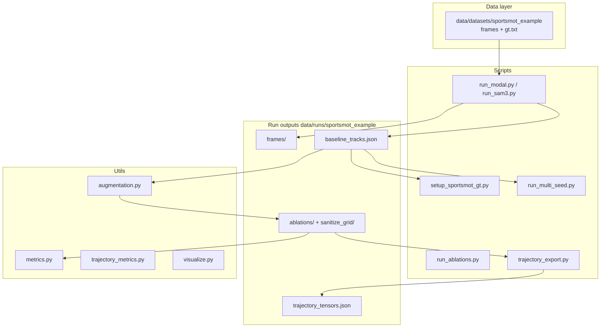

# CS231N Player Trajectories (SAM3.1)

Research project: **SAM3.1** player tracking on basketball video, a **geometry-free augmentation** layer, evaluation against **SportsMOT** ground truth, and (next) an **LSTM** trajectory forecaster.

**Write-up:** [docs/MILESTONE_CHECKLIST.md](docs/MILESTONE_CHECKLIST.md) · **Living plan:** [docs/PROJECT_PLAN.md](docs/PROJECT_PLAN.md)

---

## Architecture



| Stage | Component | Output |
|-------|-----------|--------|
| 1. Track | SAM3.1 + mask filters | `baseline_tracks.json` |
| 2. Align GT | MOT `gt.txt` → track space | `gt/gt.json` |
| 3. Augment | sanitize → rules → optional gap-fill | `ablations/*/augmented_tracks.json` |
| 4. Evaluate | metrics, ADE/FDE, ablations, grid | CSV + `recommended_config.json` |
| 5. Export | Fixed `(T,P,2)` tensors + validation | `trajectory_tensors.json` |
| 6. Multi-seed | SAM3 at time offsets (pre-LSTM) | `seeds/*/baseline_tracks.json` |
| 7. LSTM | Sequence model (planned) | TBD |

Paths are resolved via `utils/datasets.py` (`--dataset sportsmot_example`).

---

## Milestone status (short)

| Phase | Status |
|-------|--------|
| SportsMOT data + SAM3 baseline (45f) | Done |
| Real GT + ablations + sanitize grid | Done |
| LSTM export validation gate | Passed (visibility 0.94) |
| Multi-seed SAM3 | **Next** — see below |
| LSTM training | Not started |

Details: [docs/MILESTONE_CHECKLIST.md](docs/MILESTONE_CHECKLIST.md).

---

## Repository layout

```text
cs231n-player-trajectories/
├── docs/
│   ├── MILESTONE_CHECKLIST.md   # one-page report status
│   └── PROJECT_PLAN.md          # phases, architecture, multi-seed, LSTM
├── scripts/
│   ├── run_sam3.py              # SAM3 (local GPU)
│   ├── run_modal.py             # SAM3 (Modal A10G)
│   ├── setup_sportsmot_gt.py
│   ├── run_ablations.py
│   ├── run_sanitize_grid.py
│   ├── run_multi_seed.py
│   └── aggregate_experiments.py
├── utils/
│   ├── datasets.py              # canonical paths
│   ├── augmentation.py
│   ├── metrics.py
│   ├── trajectory_metrics.py
│   ├── trajectory_export.py
│   └── visualize.py
├── data/
│   ├── datasets/sportsmot_example/   # upload frames + gt.txt
│   ├── runs/sportsmot_example/       # all pipeline outputs
│   ├── archive/                      # legacy video_1 era
│   └── outputs/                      # deprecated
└── CONTEXT.md
```

---

## Requirements

- Python 3.11+
- CUDA GPU for local SAM3, or Modal account for cloud runs
- Hugging Face access: `facebook/sam3.1`

```bash
pip install sam3 torch opencv-python numpy matplotlib
```

---

## Data setup

Copy from the SportsMOT example zip:

| Zip | Repo path |
|-----|-----------|
| `img1/*.jpg` | `data/datasets/sportsmot_example/frames/` |
| `gt/gt.txt` | `data/datasets/sportsmot_example/gt/gt.txt` |
| `seqinfo.ini` | `data/datasets/sportsmot_example/seqinfo.ini` (optional) |

Do not use `data/videos/video_1.mp4` (unknown source) or proxy GT under `data/gt/sportsmot/video_1/`.

---

## Pipeline commands (SportsMOT example)

### 1) SAM3 tracking (Modal)

```powershell
py -m modal run scripts/run_modal.py --dataset sportsmot_example --skip-extract --max-frames 45 --resize-scale 0.67
py -m modal volume get sports-data runs/sportsmot_example/baseline_tracks.json data/runs/sportsmot_example/baseline_tracks.json
py -m modal volume get sports-data runs/sportsmot_example/frames data/runs/sportsmot_example/frames --force
```

### 2) Align ground truth

```powershell
py scripts/setup_sportsmot_gt.py --dataset sportsmot_example
```

### 3) Augmentation + evaluation

```powershell
py scripts/run_ablations.py --dataset sportsmot_example
py scripts/run_sanitize_grid.py --dataset sportsmot_example
py utils/trajectory_export.py --dataset sportsmot_example --validate
```

Optional canonical augmented file (LSTM v1 policy: sanitize + velocity_cap, no gap-fill):

```powershell
py utils/augmentation.py --dataset sportsmot_example --rules velocity_cap --no-gap-fill
```

### 4) Multi-seed SAM3 (before LSTM)

Copy-paste command sheet: **[docs/MULTI_SEED_COMMANDS.md](docs/MULTI_SEED_COMMANDS.md)** (download seed 1, run seeds 2–3, align GT, aggregate ADE).

```powershell
py scripts/align_seed_gt.py --dataset sportsmot_example
py scripts/run_multi_seed.py --dataset sportsmot_example --align-gt
```

`run_multi_seed.py` uses per-seed `gt_aligned.json` (not the 0s-only global GT).

### 5) Pre-LSTM gauge figures

```powershell
py scripts/plot_pre_lstm_gauge.py --dataset sportsmot_example
```

See `data/runs/sportsmot_example/figures/PRE_LSTM_GAUGE.md` for interpretation.

### 6) Visualization

```powershell
py utils/visualize.py --frames data/runs/sportsmot_example/frames ^
  --baseline data/runs/sportsmot_example/baseline_tracks.json ^
  --augmented data/runs/sportsmot_example/ablations/sanitize_plus_velocity_cap/augmented_tracks.json ^
  --output data/runs/sportsmot_example/figures/summary_figure.png --summary --n-frames 4
```

### 6) LSTM (next phase)

Train on `data/runs/sportsmot_example/trajectory_tensors.json` after multi-seed is complete. See [docs/PROJECT_PLAN.md](docs/PROJECT_PLAN.md#phase-4--lstm-trajectory-model-next).

---

## Key outputs

Under `data/runs/sportsmot_example/`:

- `baseline_tracks.json` — SAM3.1 tracks (45 frames)
- `ablations/ablation_summary.csv` — per-rule metrics + ADE
- `ablations/recommended_config.json` — ADE vs LSTM v1 policy
- `sanitize_grid/best_sanitize.json` — best sanitize hyperparameters
- `trajectory_tensors.json` / `trajectory_validation.json` — LSTM-ready arrays + gate
- `seeds/multi_seed_summary.json` — after multi-seed step

---

## Methodology notes

- Augmentation uses **relative** player geometry and motion only (no court model).
- `predicted: true` marks gap-fill re-introductions; excluded from ADE by default.
- Default SAM window: **45 frames** at **0.67** resize (Modal A10G memory tradeoff).

## Common issues

- **`No module named utils`** when running `py utils/...` — scripts insert repo root; use paths above or run from repo root.
- **`No module named torch`** locally — use Modal for SAM3, or install PyTorch in your venv.
- **Multi-seed at 20s** on a 500-frame clip — frame index exceeds sequence; use 0s / 10s / 15s offsets.
