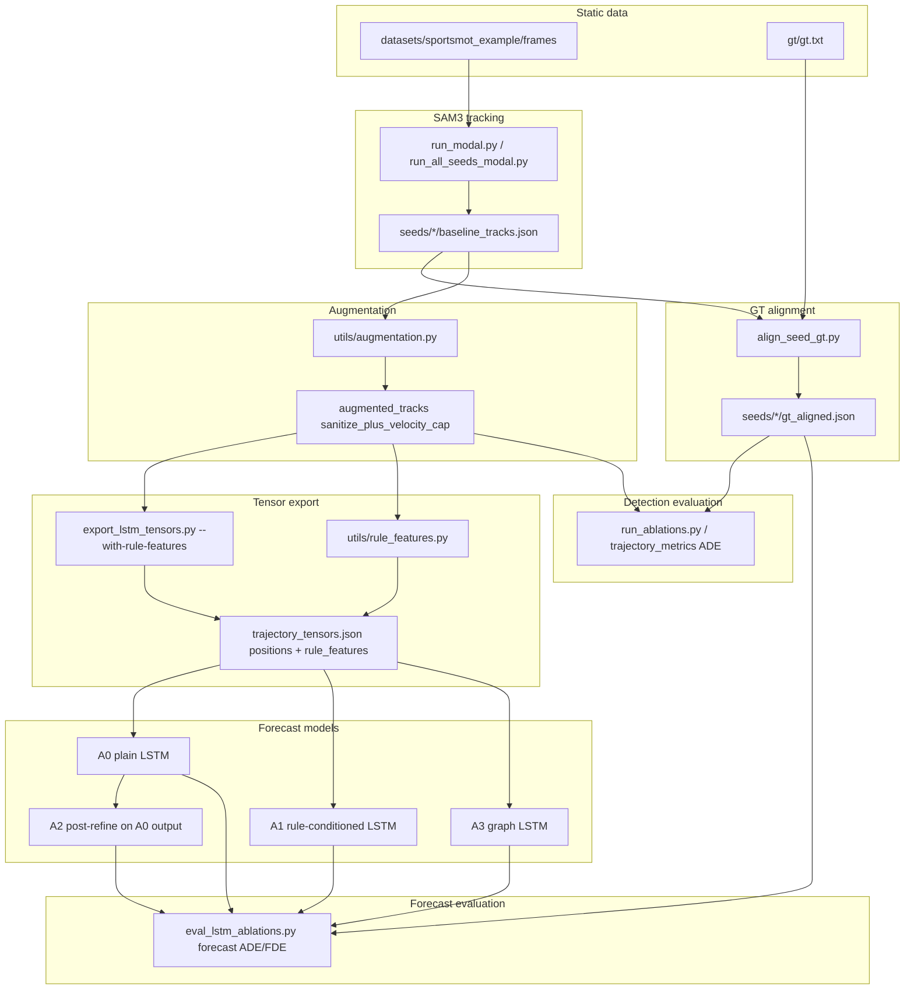

# CS231N Player Trajectories (SAM3.1)

Research project: **SAM3.1** player tracking on basketball video, a **geometry-free augmentation** layer, evaluation against **SportsMOT** ground truth, and **rule-aware LSTM** trajectory forecasting (plain, rule-conditioned, graph, and post-refine ablations).

**Write-up:** [docs/MILESTONE_CHECKLIST.md](docs/MILESTONE_CHECKLIST.md) · **Living plan:** [docs/PROJECT_PLAN.md](docs/PROJECT_PLAN.md) · **Multi-seed:** [docs/MULTI_SEED_COMMANDS.md](docs/MULTI_SEED_COMMANDS.md)

**Generative AI attribution (CS231N policy):** [docs/GENERATIVE_AI_USE.md](docs/GENERATIVE_AI_USE.md) — transcripts, prompts, plans, and registry of all AI-assisted artifacts. Run `py scripts/audit_repository.py` to verify coverage.

---

## Architecture



| Stage | Component | Output |
|-------|-----------|--------|
| 1. Track | SAM3.1 + mask filters | `seeds/{seed_id}/baseline_tracks.json` |
| 2. Align GT | MOT `gt.txt` → track space | `seeds/{seed_id}/gt_aligned.json` |
| 3. Augment | sanitize → rules → optional gap-fill | `ablations/*/augmented_tracks.json` |
| 4. Evaluate | metrics, ADE/FDE, ablations, grid | CSV + `recommended_config.json` |
| 5. Export | `(T,P,2)` positions + optional `rule_features` | `seeds/*/trajectory_tensors.json` |
| 6. Multi-seed | SAM3 at 2s offsets (12 windows) | `seeds/seed_manifest.json` |
| 7. LSTM | A0–A3 train / predict / ablation eval | `lstm/lstm_*/checkpoint.pt`, `lstm_ablation_summary.csv` |

Paths are resolved via `utils/datasets.py` (`--dataset sportsmot_example`).

---

## Milestone status (short)

| Phase | Status |
|-------|--------|
| SportsMOT data + SAM3 baseline | Done |
| Real GT + ablations + sanitize grid | Done |
| Multi-seed SAM3 (12 seeds @ 2s step) | Done |
| LSTM export + rule features (15-dim) | Done |
| Rule-aware LSTM A0–A3 + ablation tables | Done |

Details and report numbers: [docs/MILESTONE_CHECKLIST.md](docs/MILESTONE_CHECKLIST.md).

---

## Repository layout

```text
cs231n-player-trajectories/
├── docs/
│   ├── MILESTONE_CHECKLIST.md   # one-page report status + LSTM ablation table
│   ├── PROJECT_PLAN.md          # phases, architecture, LSTM variants
│   └── MULTI_SEED_COMMANDS.md   # Modal multi-seed orchestration
├── scripts/
│   ├── run_modal.py / run_sam3.py
│   ├── run_all_seeds_modal.py   # Modal + align GT + multi-seed metrics
│   ├── align_seed_gt.py / setup_sportsmot_gt.py
│   ├── run_ablations.py / run_sanitize_grid.py
│   ├── export_lstm_tensors.py   # --with-rule-features
│   ├── train_lstm.py            # --model plain|rule_features|graph
│   ├── predict_lstm.py          # --post-refine for A2
│   ├── eval_lstm.py / eval_lstm_ablations.py
│   ├── eval_rule_feature_ablation.py / eval_autoregressive_compare.py
│   ├── diagnose_lstm_seeds.py / audit_lstm.py
│   └── plot_pre_lstm_gauge.py
├── models/
│   ├── trajectory_lstm.py       # TrajectoryLSTM, RuleConditionedLSTM
│   └── trajectory_graph_lstm.py # TrajectoryGraphLSTM (A3)
├── utils/
│   ├── augmentation.py, rule_features.py
│   ├── lstm_dataset.py, lstm_predict.py
│   ├── trajectory_export.py, trajectory_metrics.py
│   └── datasets.py
├── data/
│   ├── datasets/sportsmot_example/
│   └── runs/sportsmot_example/   # seeds/, lstm/, figures/, ablations/
└── CONTEXT.md
```

---

## Requirements

- Python 3.11+
- CUDA GPU for local SAM3, or Modal account for cloud runs
- Hugging Face access: `facebook/sam3.1`
- PyTorch for LSTM training/eval (local CPU is fine for small models)

```bash
pip install sam3 torch opencv-python numpy matplotlib
```

---

## Data setup

### SportsMOT full dataset (basketball only)

The 16GB `sportsmot_publish.zip` contains basketball, football, and volleyball. Extract **only basketball** (~80 clips):

```powershell
py scripts/extract_sportsmot_basketball.py --zip data/sportsmot_publish.zip --list-only
py scripts/extract_sportsmot_basketball.py --zip data/sportsmot_publish.zip
```

Output: `data/datasets/sportsmot_basketball/` (gitignored). See [data/datasets/sportsmot_basketball/README.md](data/datasets/sportsmot_basketball/README.md).

Copy from the SportsMOT example zip:

| Zip | Repo path |
|-----|-----------|
| `img1/*.jpg` | `data/datasets/sportsmot_example/frames/` |
| `gt/gt.txt` | `data/datasets/sportsmot_example/gt/gt.txt` |
| `seqinfo.ini` | `data/datasets/sportsmot_example/seqinfo.ini` (optional) |

See [data/datasets/sportsmot_example/README.md](data/datasets/sportsmot_example/README.md).

### 36-hour sprint (report + transfer eval)

| Doc | Purpose |
|-----|---------|
| [docs/PROJECT_STATUS.md](docs/PROJECT_STATUS.md) | **Start here** — honest answers, claims, limitations, regenerate commands |
| [docs/RESEARCH_REPORT.md](docs/RESEARCH_REPORT.md) | Full project write-up |
| [docs/PAPER_RESULTS.md](docs/PAPER_RESULTS.md) | Auto-generated result tables |
| [docs/MODAL_SPRINT_RUNBOOK.md](docs/MODAL_SPRINT_RUNBOOK.md) | Extract, register, Modal batch |
| [data/datasets/EXTRACTION_STATUS.md](data/datasets/EXTRACTION_STATUS.md) | Extracted sequences + seed counts |

Register an extracted sequence: `py scripts/register_sportsmot_sequence.py <seq_id>`. Extra datasets load from `data/datasets/extra_datasets.json`.

---

## Pipeline commands (SportsMOT example)

### 1) Multi-seed SAM3 (recommended)

```powershell
py scripts/run_all_seeds_modal.py --dataset sportsmot_example --step-sec 2 --skip-existing
```

Then export tensors with rule features for all seeds:

```powershell
py scripts/export_lstm_tensors.py --dataset sportsmot_example --all-seeds --with-rule-features
```

Manual steps: [docs/MULTI_SEED_COMMANDS.md](docs/MULTI_SEED_COMMANDS.md). Use `py -m modal` if `modal` is not on PATH.

### 2) Align ground truth (if not done by orchestrator)

```powershell
py scripts/align_seed_gt.py --dataset sportsmot_example
py scripts/setup_sportsmot_gt.py --dataset sportsmot_example
```

### 3) Augmentation + detection ablations

```powershell
py scripts/run_ablations.py --dataset sportsmot_example
py scripts/run_sanitize_grid.py --dataset sportsmot_example
```

LSTM input policy: `sanitize_plus_velocity_cap` (same SAM3 positions for A0 and A1; A1 adds rule **features** in the network).

### 4) Rule-aware LSTM (A0–A3)

Train all forecaster variants on **all seeds** with temporal split:

```powershell
py scripts/train_lstm.py --model plain --split held_out_seed --val-seed offset_0s --epochs 80
py scripts/train_lstm.py --model rule_features --split held_out_seed --val-seed offset_0s --epochs 80

**Residual LSTM (linear prior + learned correction, optimizes val forecast ADE):**

```powershell
py scripts/train_lstm.py --model rule_features --split held_out_seed --val-seed offset_0s ^
  --residual --optimize-forecast-ade --scheduled-sampling --epochs 80
py scripts/eval_lstm_ablations.py --dataset sportsmot_example --all-seeds --skip-attribution
```
py scripts/train_lstm.py --model graph --split held_out_seed --val-seed offset_0s --epochs 80
py scripts/train_lstm.py --model rule_features --split held_out_seed --rule-loss-weight 0.001 --out-dir data/runs/sportsmot_example/lstm/lstm_rule_features_a1b
```

Evaluate forecast-horizon ADE/FDE vs linear and SAM baselines:

```powershell
py scripts/eval_lstm_ablations.py --dataset sportsmot_example --all-seeds --diagnose-seeds
py scripts/eval_rule_feature_ablation.py --all-seeds
py scripts/eval_autoregressive_compare.py
py scripts/diagnose_lstm_seeds.py
```

Optional A2 post-refine (rules applied to plain LSTM predictions, no extra training):

```powershell
py scripts/predict_lstm.py --checkpoint data/runs/sportsmot_example/lstm/lstm_plain/checkpoint.pt --post-refine game
```

Diagnostics:

```powershell
py scripts/audit_lstm.py
py scripts/eval_lstm.py --dataset sportsmot_example --linear-baseline
```

| Variant | CLI | Role |
|---------|-----|------|
| **A0** | `--model plain` | Positions-only LSTM |
| **A1** | `--model rule_features` | LSTM + per-frame rule/social features |
| **A2** | `--post-refine` on predict | Same augmentation rules on **forecast** tracks |
| **A3** | `--model graph` | Lightweight graph/message-passing + temporal LSTM |

**Training split:** Default for the report is `--split held_out_seed --val-seed offset_0s` (train 11 seeds, validate on `offset_0s`). For maximum training windows on all clips, use `--split temporal_all`. Do not mix run-root `trajectory_tensors.json` (0.67 resize) with `seeds/offset_*` tensors (0.5 resize).

### 5) Per-clip retrain on new basketball sequences

After Modal + tensor export on registered clips (`extra_datasets.json`):

```powershell
foreach ($ds in @("sportsmot_v_6os86hzwcs_c001","sportsmot_v_6os86hzwcs_c003","sportsmot_v_00hrwkvvjtq_c001")) {
  py scripts/train_lstm.py --dataset $ds --model rule_features --residual --split held_out_seed --val-seed offset_0s --epochs 80 --scheduled-sampling --optimize-forecast-ade
  py scripts/eval_lstm_ablations.py --dataset $ds --all-seeds --skip-attribution
}
py scripts/aggregate_multiseq_eval.py --output data/runs/multiseq_perclip_summary.csv --training-mode per_clip
py scripts/plot_multiseq_transfer.py
py scripts/generate_paper_results.py
```

Figures: `data/runs/figures/multiseq_perclip_bar.png`, `multiseq_train_vs_transfer.png`.

### 6) Pre-LSTM gauge figures

```powershell
py scripts/plot_pre_lstm_gauge.py --dataset sportsmot_example
```

### 7) Visualization

```powershell
py utils/visualize.py --frames data/runs/sportsmot_example/frames ^
  --baseline data/runs/sportsmot_example/baseline_tracks.json ^
  --augmented data/runs/sportsmot_example/ablations/sanitize_plus_velocity_cap/augmented_tracks.json ^
  --output data/runs/sportsmot_example/figures/summary_figure.png --summary --n-frames 4

py scripts/plot_forecast_qualitative.py --dataset sportsmot_example --seed-id offset_0s
```

Forecast overlay figure: `figures/forecast_qualitative.png` (observed 8f, LSTM vs GT vs linear 4f).

### 8) Generative AI attribution (CS231N policy)

```powershell
py scripts/export_conversation_transcript.py
py scripts/generate_ai_attribution_docs.py
```

Hub: [docs/GENERATIVE_AI_USE.md](docs/GENERATIVE_AI_USE.md) (transcripts, prompts, plans, artifact registry).

---

## Key outputs

Under `data/runs/sportsmot_example/`:

| Path | Description |
|------|-------------|
| `seeds/seed_manifest.json` | 12 seeds @ 2s step (0s–18s) |
| `seeds/*/trajectory_tensors.json` | Positions + `rule_features` (15-dim) |
| `seeds/multi_seed_summary.json` | Detection ADE across seeds |
| `lstm/lstm_plain/`, `lstm_rule_features/`, `lstm_graph/`, `lstm_rule_features_residual/` | Checkpoints per variant |
| `lstm/lstm_ablation_summary.csv` | A0–A3 vs linear/SAM (forecast horizon) |
| `lstm/lstm_ablation_multi_seed.json` | Per-seed + aggregate metrics |
| `lstm/lstm_rule_attribution.csv` | Per-rule ΔADE (A2 attribution) |
| `lstm/lstm_per_seed_delta.csv` | Per-seed A1 − A0 forecast ADE |
| `lstm/lstm_ablation_robust.json` | Median ADE + win rate |
| `lstm/seed_diagnosis.json` | Per-seed visibility / export gate |
| `lstm/lstm_rule_feature_group_ablation.csv` | A1 feature-group masking |
| `lstm/lstm_autoregressive_compare.csv` | Fixed vs AR rule features |
| `lstm/lstm_rule_features_a1b/` | A1 + soft rule penalty checkpoint |
| `figures/lstm_rule_ablation_bar.png` | Variant comparison bar chart |
| `figures/lstm_per_rule_delta_ade.png` | Post-refine rule attribution |
| `figures/forecast_qualitative.png` | LSTM forecast vs GT trajectory overlays |

---

## Report snapshot (12 seeds, held-out training, forecast ADE)

Models trained with `held_out_seed` (`offset_0s` validation only). **Use median ADE** on train seeds — a few late-clip seeds have high rollout error and inflate the mean.

| Variant | Median forecast ADE (px) | Mean forecast ADE (px) | A1 wins vs A0 |
|---------|--------------------------|--------------------------|---------------|
| **A1 rule features** | **7.51** | 17.0 | **10 / 12 seeds** |
| A3 graph | 8.67 | 16.3 | — |
| A0 plain | 10.68 | 17.0 | — |

Example train seed (`offset_2s`): A1 **4.86 px**, A0 6.66 px, linear ~6.4 px. Held-out `offset_0s` is not in training — expect poor rollout there (~40–45 px).

Post-hoc game rules on forecasts (A2) **hurt** ADE, consistent with detection ablations. See `lstm/lstm_ablation_robust.json` and `lstm/lstm_per_seed_delta.csv`.

---

## Methodology notes

- Augmentation uses **relative** player geometry and motion only (no court model).
- **Plain LSTM (A0)** still uses `sanitize_plus_velocity_cap` **positions**; “plain” means no rule features **in the network**.
- **A1** adds geometry-free signals (speed, hull margin, spacing, game-state flags) from `utils/rule_features.py`.
- Evaluate LSTM with **forecast-horizon** ADE (frames after `obs_len`), not full-clip detection ADE.
- Default SAM window: **45 frames**; multi-seed runs use **resize_scale 0.5** (640×360).

## Common issues

- **`No module named utils`** — run scripts from repo root (`py scripts/...`).
- **`No module named torch`** — `pip install torch` for LSTM; SAM3 can stay on Modal.
- **Modal connection failed** — retry `run_all_seeds_modal.py`; existing seeds are kept with `--skip-existing`.
- **`modal` not on PATH** — use `py -m modal run ...`.
