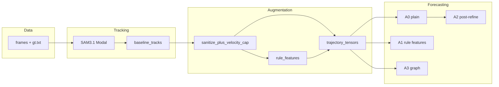

# CS231N Milestone Checklist (Write-Up)

One-page status for the report. Primary dataset: **SportsMOT example**, 45-frame SAM window, `data/runs/sportsmot_example/`.

## Pipeline at a glance



---

## Milestone table

| # | Deliverable | Status | Evidence / notes |
|---|-------------|--------|----------------|
| 1 | **Dataset**: SportsMOT example frames + `gt.txt` | Done | `data/datasets/sportsmot_example/` |
| 2 | **SAM3 baseline** (45 frames, 0.67 scale) | Done | `data/runs/sportsmot_example/baseline_tracks.json` |
| 3 | **Aligned GT** (real MOT, not proxy) | Done | `data/datasets/sportsmot_example/gt/gt.json` |
| 4 | **Augmentation layer** (sanitize + rules + gap-fill gate) | Done | `utils/augmentation.py` |
| 5 | **Per-rule ablations** + ADE/FDE | Done | `ablations/ablation_summary.csv` |
| 6 | **Sanitize grid** (ADE-ranked) | Done | `sanitize_grid/best_sanitize.json` → `w0.4_y0.1_p10` |
| 7 | **LSTM export** + validation gate | Done | `trajectory_tensors.json`, `trajectory_validation.json` (`passed: true`) |
| 8 | **Multi-seed SAM3** (12 offsets @ 2s) | Done | `seeds/seed_manifest.json`, `multi_seed_summary.json` |
| 9 | **Paper figures** (SportsMOT run) | Done | `figures/PRE_LSTM_GAUGE.md` + gauge PNGs |
| 10 | **LSTM v1** train / eval | Done | `lstm/lstm_plain/`, `eval_lstm.py` |
| 11 | **Rule-aware LSTM** (A0–A3 ablations) | Done | `lstm/lstm_ablation_summary.csv`, `figures/lstm_rule_ablation_bar.png` |
| 12 | **Rule feature export** (15-dim) | Done | `utils/rule_features.py`; tensors include `rule_features` |
| 13 | **Step-sec 2 multi-seed (12 windows)** | Done | 12 seeds @ 2s step; tensors + rule features exported |
| 14 | **A1 residual LSTM** (forecast ADE, ties linear) | Done | `lstm/lstm_rule_features_residual/`; see `docs/PAPER_RESULTS.md` |
| 15 | **36h sprint infra** (register, batch Modal, transfer CSV) | Done | `scripts/register_sportsmot_sequence.py`, `MODAL_SPRINT_RUNBOOK.md` |
| 16 | **Cross-sequence transfer (3 clips)** | Done | `multiseq_transfer_summary.csv`; holdout residual 4.99 vs linear 5.01 |

---

## Results to cite (SportsMOT 45-frame window)

| Metric | Baseline | Best augmentation (ADE) | LSTM v1 policy config |
|--------|----------|---------------------------|------------------------|
| Mean observed players/frame | 10.76 | 10.42 (post-sanitize) | `sanitize_plus_velocity_cap` |
| ID switches | 0 | 0 | same |
| Mean displacement (px) | 3.57 | ~3.67 (`sanitize_plus_velocity_cap`) | velocity_cap **inactive** on this clip |
| ADE vs aligned GT (px) | **7.16** | **7.08** (`dead_ball_freeze`) | sanitize+velocity_cap **7.34** |
| Sanitize grid best ADE | — | **5.87** (`w0.4_y0.1_p10`, velocity_cap rule) | consider for report |
| Export global visibility | — | **0.94** (gate passed) | from `sanitize_plus_velocity_cap` export |

**Report framing:** Baseline SAM3.1 is already strong on this clip; augmentation mainly **prunes crowd/over-detections** (sanitize). Game rules and `full` **hurt ADE** on real GT. Prefer **minimal physical + sanitize** for LSTM inputs.

---

## Blockers (original → current)

| Blocker | Was | Now |
|---------|-----|-----|
| Unknown `video_1` + proxy GT | Invalid ADE | **Cleared** — SportsMOT `gt.txt` + aligned `gt.json` |
| Export validation | Failed on old run | **Cleared** — `passed: true`, visibility 0.94 |
| Multi-seed stability | Bootstrap only | **Cleared** — 12 offsets @ 2s step |
| LSTM train (local) | **Cleared** | A0–A3 trained; `lstm_ablation_summary.csv` |

---

## Optional / out of scope for milestone

- Full 500-frame SAM3 session (VRAM); 45-frame window is sufficient for milestone.
- `seqinfo.ini` (defaults 1280×720 @ 25 FPS used if missing).
- NBA clips in `data/clips/` (secondary; not on real SportsMOT GT).

---

## Rule-aware LSTM (forecast horizon, 12 seeds @ 2s step)

**Training split (latest):** `held_out_seed` — train 11 seeds, validate `offset_0s`.

| Variant | Median forecast ADE (px) | Mean forecast ADE (px) | Notes |
|---------|-------------------------|------------------------|--------|
| **A1 residual (headline)** | **5.81** | 5.62 | Ties linear median; beats linear on **5/12** seeds |
| A1 rule features | 7.51 | 17.0 | Beats A0 on **10/12** seeds |
| A3 graph | 8.67 | 16.3 | Best mean on held-out training |
| A0 plain | 10.68 | 17.0 | Positions-only |
| Linear baseline | 5.81 | 5.60 | Primary forecast comparison |
| A1b (+ rule loss) | — | — | `lstm/lstm_rule_features_a1b/` |

**Held-out `offset_0s`:** A0/A1 degrade (not in training); report **median over train seeds** for generalization.

**Feature groups (A1 inference ablation):** `lstm_rule_feature_group_ablation.csv` — full 15-dim best on most train seeds; `game_state_only` competitive on some.

**Autoregressive rule recompute:** `lstm_autoregressive_compare.csv` — mixed vs fixed SAM-derived rules; not uniformly better.

Per-rule post-refine attribution: `lstm/lstm_rule_attribution.csv`, `figures/lstm_per_rule_delta_ade.png`.

Diagnostics: `lstm/seed_diagnosis.json`, `lstm/lstm_ablation_robust.json`.

---

## Commands (copy-paste)

```bash
py scripts/export_lstm_tensors.py --dataset sportsmot_example --all-seeds --with-rule-features
py scripts/train_lstm.py --model plain --split held_out_seed --val-seed offset_0s
py scripts/train_lstm.py --model rule_features --split held_out_seed --rule-loss-weight 0.001 --out-dir data/runs/sportsmot_example/lstm/lstm_rule_features_a1b
py scripts/eval_lstm_ablations.py --all-seeds --diagnose-seeds
py scripts/eval_rule_feature_ablation.py --all-seeds
py scripts/eval_autoregressive_compare.py
py scripts/diagnose_lstm_seeds.py
```

See **README.md** (full pipeline), **docs/PROJECT_STATUS.md** (report-ready status + claims), and **docs/PROJECT_PLAN.md** (multi-seed + LSTM ordering).
