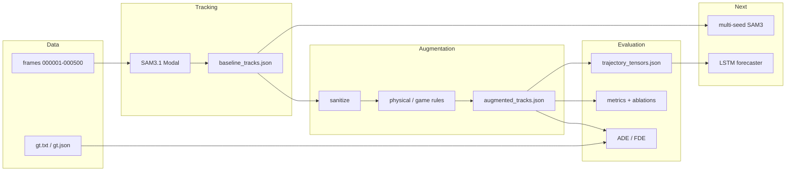

# CS231N Milestone Checklist (Write-Up)

One-page status for the report. Primary dataset: **SportsMOT example**, 45-frame SAM window, `data/runs/sportsmot_example/`.

## Pipeline at a glance

---

## Milestone table

| # | Deliverable | Status | Evidence / notes |
|---|-------------|--------|----------------|
| 1 | **Dataset**: SportsMOT example frames + `gt.txt` | Done | `data/datasets/sportsmot_example/` |
| 2 | **SAM3 baseline** (45 frames, 0.67 scale) | Done | `data/runs/sportsmot_example/baseline_tracks.json` |
| 3 | **Aligned GT** (real MOT, not proxy) | Done | `data/datasets/sportsmot_example/gt/gt.json` |
| 4 | **Augmentation layer** (sanitize + rules + gap-fill gate) | Done | `utils/augmentation.py` |
| 5 | **Per-rule ablations** + ADE/FDE | Done | `ablations/ablation_summary.csv` |
| 6 | **Sanitize grid** (ADE-ranked) | Done | `sanitize_grid/best_sanitize.json` → `w0.4_y0.1_p10` |
| 7 | **LSTM export** + validation gate | Done | `trajectory_tensors.json`, `trajectory_validation.json` (`passed: true`) |
| 8 | **Multi-seed SAM3** (0s / 10s / 15s offsets) | Done | `seeds/multi_seed_summary.json`, per-seed `gt_aligned.json` |
| 9 | **Paper figures** (SportsMOT run) | Done | `figures/PRE_LSTM_GAUGE.md` + gauge PNGs |
| 10 | **LSTM v1** train / eval | Done | `lstm/checkpoint.pt`, `lstm_eval.json`; val loss ≈ 0.024; see forecast ADE in eval |

---

## Results to cite (SportsMOT 45-frame window)

| Metric | Baseline | Best augmentation (ADE) | LSTM v1 policy config |
|--------|----------|---------------------------|------------------------|
| Mean observed players/frame | 10.76 | 10.42 (post-sanitize) | `sanitize_plus_velocity_cap` |
| ID switches | 0 | 0 | same |
| Mean displacement (px) | 3.57 | ~3.67 (`sanitize_plus_velocity_cap`) | velocity_cap **inactive** on this clip |
| ADE vs aligned GT (px) | **7.16** | **7.08** (`dead_ball_freeze`) | sanitize+velocity_cap **7.34** |
| Sanitize grid best ADE | — | **5.87** (`w0.4_y0.1_p10`, velocity_cap rule) | consider for report |
| Export global visibility | — | **0.94** (gate passed) | from `sanitize_plus_velocity_cap` export |

**Report framing:** Baseline SAM3.1 is already strong on this clip; augmentation mainly **prunes crowd/over-detections** (sanitize). Game rules and `full` **hurt ADE** on real GT. Prefer **minimal physical + sanitize** for LSTM inputs.

---

## Blockers (original → current)

| Blocker | Was | Now |
|---------|-----|-----|
| Unknown `video_1` + proxy GT | Invalid ADE | **Cleared** — SportsMOT `gt.txt` + aligned `gt.json` |
| Export validation | Failed on old run | **Cleared** — `passed: true`, visibility 0.94 |
| Multi-seed stability | Bootstrap only | **Cleared** — 3 real offsets, ADE 5.94 ± 1.09 px |
| LSTM train (local) | **Cleared** | Trained multi-seed; eval in `lstm/lstm_eval.json` |

---

## Optional / out of scope for milestone

- Full 500-frame SAM3 session (VRAM); 45-frame window is sufficient for milestone.
- `seqinfo.ini` (defaults 1280×720 @ 25 FPS used if missing).
- NBA clips in `data/clips/` (secondary; not on real SportsMOT GT).

---

## Commands (copy-paste)

See **README.md** (full pipeline) and **docs/PROJECT_PLAN.md** (multi-seed + LSTM ordering).
