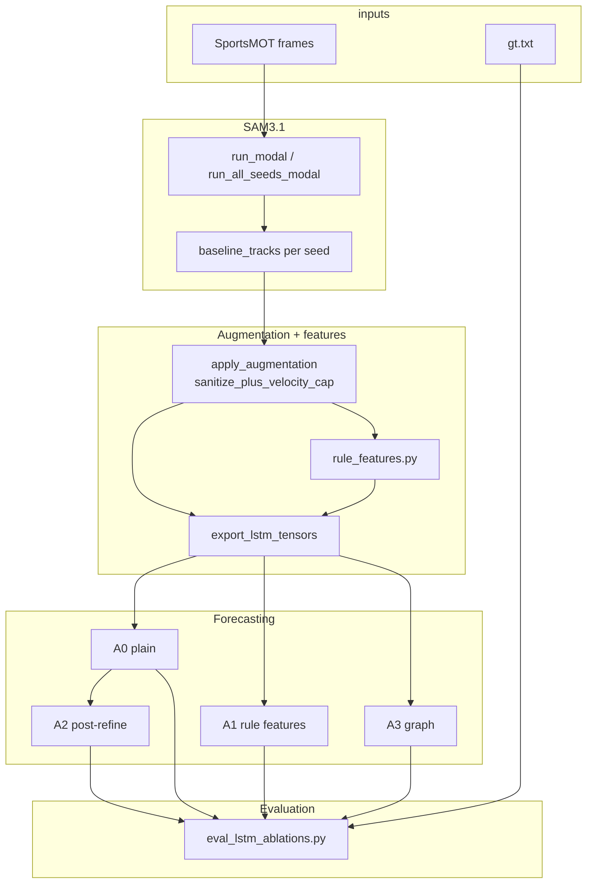

# Project Plan — SAM3.1 Tracking → Augmentation → Rule-Aware LSTM

Living plan for `cs231n-player-trajectories`. Updated after 12-seed rule-aware LSTM training (May 2026).

Related docs: [MILESTONE_CHECKLIST.md](MILESTONE_CHECKLIST.md), [README.md](../README.md), [MULTI_SEED_COMMANDS.md](MULTI_SEED_COMMANDS.md), [data/datasets/sportsmot_example/README.md](../data/datasets/sportsmot_example/README.md).

---

## Phases

### Phase 1 — SAM3.1 baseline tracking

**Goal:** Per-frame player tracks from broadcast basketball video.

| Task | Status |
|------|--------|
| Modal GPU pipeline (`run_modal.py`, A10G, offload CPU) | Done |
| Frame prep from SportsMOT `img1` | Done |
| Filter geometry-only detections | Done |
| Save `baseline_tracks.json` + meta | Done |

**Outputs:** `data/runs/sportsmot_example/seeds/{seed_id}/baseline_tracks.json`

---

### Phase 2 — Geometry-free augmentation

**Goal:** Improve track quality without court calibration; support ablations.

| Task | Status |
|------|--------|
| Stage 0: `sanitize_detections` | Done |
| Stage 1: `RULE_REGISTRY` + per-rule ablations | Done |
| Stage 2: gated `reid_gap_fill` | Done |
| Sanitize parameter grid | Done |
| ADE/FDE vs MOT GT | Done |

**Findings:** `velocity_cap` often inactive; game rules increase detection ADE; minimal `sanitize_plus_velocity_cap` is the LSTM input policy.

---

### Phase 3 — Pre-LSTM validation

**Goal:** Gate LSTM training on real GT and export quality.

| Task | Status |
|------|--------|
| SportsMOT `gt.txt` → aligned `gt.json` | Done |
| `trajectory_export.py` + validation gate | Done |
| **Multi-seed SAM3** (12 offsets @ 2s step) | Done — `run_all_seeds_modal.py` |
| Per-seed `gt_aligned.json` | Done |
| Rule feature export (`--with-rule-features`) | Done |

**Outputs:** `seeds/*/trajectory_tensors.json` with `rule_features` (15-dim)

---

### Phase 4 — Rule-aware LSTM forecasting

**Goal:** Predict future `(x,y)` from SAM3 history; compare how rules affect **forecasts** (not only detections).

| Variant | ID | Status | Implementation |
|---------|-----|--------|----------------|
| Plain LSTM | A0 | Done | `TrajectoryLSTM`, positions only |
| Rule-conditioned LSTM | A1 | Done | `RuleConditionedLSTM` + `utils/rule_features.py` |
| Post-refine | A2 | Done | `post_refine_tracks()` in `utils/lstm_predict.py` |
| Graph / social LSTM | A3 | Done | `TrajectoryGraphLSTM` |

| Task | Status |
|------|--------|
| Dataset loader + `temporal_all` split | Done |
| `train_lstm.py --model plain\|rule_features\|graph` | Done |
| `eval_lstm_ablations.py` (forecast ADE, attribution) | Done |
| Report tables + figures | Done — `lstm_ablation_summary.csv`, bar charts |

**Recommended training:** `--split temporal_all` on all exported seeds; 80 epochs; do not use `held_out_seed` with sparse seeds.

**Evaluation protocol:**

- **Forecast-horizon ADE/FDE** (frames ≥ `obs_len`) vs `gt_aligned.json`
- **Teacher-forced** one-step error on SAM history
- Baselines: linear extrapolation, SAM augmented **detections** (ceiling for perception, not forecast)

---

## Architecture (detailed)



---

## Multi-seed runs

**Current schedule:** 12 seeds at **2s** step (`offset_0s` … `offset_18s`), 45 frames each, **resize_scale 0.5**.

```powershell
py scripts/run_all_seeds_modal.py --dataset sportsmot_example --step-sec 2 --skip-existing
py scripts/export_lstm_tensors.py --dataset sportsmot_example --all-seeds --with-rule-features
```

Manifest: `data/runs/sportsmot_example/seeds/seed_manifest.json`

See [MULTI_SEED_COMMANDS.md](MULTI_SEED_COMMANDS.md) for manual Modal steps and OOM notes.

---

## LSTM commands (copy-paste)

```powershell
py scripts/train_lstm.py --model plain --split temporal_all --epochs 80
py scripts/train_lstm.py --model rule_features --split temporal_all --epochs 80
py scripts/train_lstm.py --model graph --split temporal_all --epochs 80
py scripts/eval_lstm_ablations.py --dataset sportsmot_example --all-seeds
```

---

## Legacy / deprecated

| Item | Location | Note |
|------|----------|------|
| `video_1.mp4` | `data/videos/`, `data/archive/` | Do not cite for ADE |
| Proxy GT | `data/gt/sportsmot/video_1/` | Superseded by SportsMOT example |
| Run-root tensor at 0.67 | `trajectory_tensors.json` | Different resize than `seeds/` — do not mix in training |

Canonical status: this file + `MILESTONE_CHECKLIST.md`.
