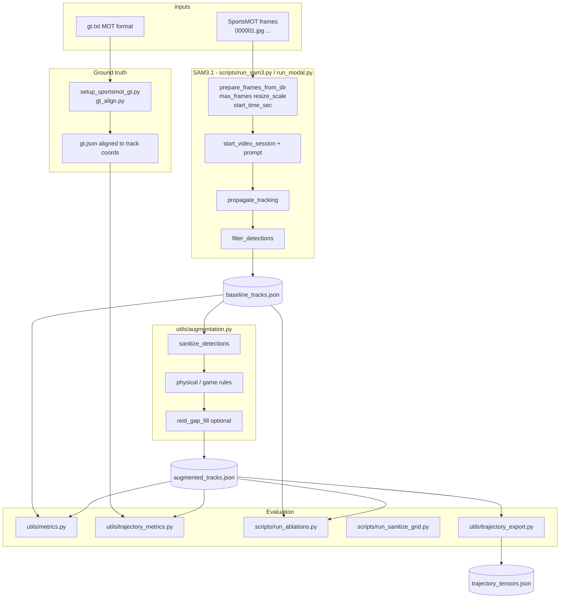

# Project Plan — SAM3.1 Tracking → Augmentation → LSTM

Living plan for `cs231n-player-trajectories`. Updated after the SportsMOT example rerun (May 2026).

Related docs: [MILESTONE_CHECKLIST.md](MILESTONE_CHECKLIST.md), [README.md](../README.md), [data/datasets/sportsmot_example/README.md](../data/datasets/sportsmot_example/README.md).

---

## Phases

### Phase 1 — SAM3.1 baseline tracking

**Goal:** Per-frame player tracks from broadcast basketball video.

| Task | Status |
|------|--------|
| Modal GPU pipeline (`run_modal.py`, A10G, offload CPU) | Done |
| Frame prep from SportsMOT `img1` (`prepare_frames_from_dir`) | Done |
| Filter geometry-only detections (`filter_detections`) | Done |
| Save `baseline_tracks.json` + meta (resolution, scale) | Done |

**Outputs:** `data/runs/sportsmot_example/baseline_tracks.json`, `frames/`

---

### Phase 2 — Geometry-free augmentation

**Goal:** Improve track quality without court calibration; support ablations.

| Task | Status |
|------|--------|
| Stage 0: `sanitize_detections` | Done |
| Stage 1: `RULE_REGISTRY` + per-rule ablations | Done |
| Stage 2: gated `reid_gap_fill` (`--no-gap-fill` for LSTM v1) | Done |
| Combo ablations (`sanitize_plus_velocity_cap`, etc.) | Done |
| Sanitize parameter grid (`run_sanitize_grid.py`) | Done |
| Metrics: smoothness, coverage, compare (`utils/metrics.py`) | Done |
| ADE/FDE vs MOT GT (`utils/trajectory_metrics.py`, `gt_align.py`) | Done |

**Outputs:** `ablations/`, `sanitize_grid/`, `recommended_config.json`

**Findings (SportsMOT 45f):** `velocity_cap` fired 0×; game rules increase ADE; `dead_ball_freeze` slightly best ADE; grid `w0.4_y0.1_p10` best ADE in sanitize sweep.

---

### Phase 3 — Pre-LSTM validation

**Goal:** Gate LSTM training on real GT and export quality.

| Task | Status |
|------|--------|
| Replace proxy GT with SportsMOT `gt.txt` | Done |
| `setup_sportsmot_gt.py` → aligned `gt.json` | Done |
| `run_ablations.py` with ADE in summary CSV | Done |
| `trajectory_export.py` + `--validate` | Done (passed) |
| **Multi-seed SAM3** (real temporal offsets) | **In progress** — `docs/MULTI_SEED_COMMANDS.md` |
| Regenerate summary figure on SportsMOT frames | Pending |

**Outputs:** `gt/gt.json`, `trajectory_tensors.json`, `trajectory_validation.json`

---

### Phase 4 — LSTM trajectory model (next)

**Goal:** Sequence model on `(T, P, 2)` positions + visibility mask; report ADE/FDE vs GT.

| Task | Status |
|------|--------|
| Dataset loader from `trajectory_tensors.json` | Not started |
| Train/val split (same 45f window or multi-seed windows) | Not started |
| Baseline LSTM / GRU forecaster | Not started |
| Compare SAM3+aug vs LSTM-corrected trajectories | Not started |

**Recommended input config (policy):** `sanitize_plus_velocity_cap`, `gap_fill: false`  
**ADE-leading config (report):** `dead_ball_freeze` or sanitize grid `w0.4_y0.1_p10` — document choice in write-up.

---

## Architecture (detailed)



**Path resolution:** `utils/datasets.py` — `--dataset sportsmot_example` → `data/datasets/...` and `data/runs/...`.

---

## Multi-seed runs (before LSTM)

**Purpose:** Measure whether augmentation gains hold across different temporal windows (not bootstrap slices of one run).

**Offsets:** At 25 FPS on a 500-frame (~20 s) clip:

| Seed ID | `start_time_sec` | MOT frame start (approx.) | Notes |
|---------|------------------|---------------------------|--------|
| `offset_0s` | 0 | 1 | Frames 1–45 |
| `offset_10s` | 10 | 251 | Frames 251–295 |
| `offset_15s` | 15 | 376 | Use instead of 20s (20s ≈ frame 501, past end) |

Default code uses `offset_20s`; for SportsMOT example prefer **`offset_15s`** or change `DEFAULT_SEEDS` in `run_multi_seed.py`.

### Step A — SAM3 on Modal (three jobs)

**CUDA OOM on the 2nd/3rd run?** Modal often **reuses the same GPU container**. The first job leaves SAM3 weights in PyTorch’s CUDA cache; the second job loads the model again and can exceed A10G 24 GB. Fixes: wait for each run to finish, use the repo’s post-run GPU cleanup (in `run_sam3.release_sam3_predictor`), or lower `--resize-scale 0.5` / `--max-frames 30` / `--max-num-objects 12`. Do not start two `modal run` jobs at the same time.

Upload frames once; then run each seed (`--skip-upload` after first):

```powershell
# Seed 0 — also produces main baseline if you have not run yet
py -m modal run scripts/run_modal.py --dataset sportsmot_example --skip-extract --max-frames 45 --resize-scale 0.67 --start-time-sec 0 --seed-id offset_0s

py -m modal run scripts/run_modal.py --dataset sportsmot_example --skip-extract --max-frames 45 --resize-scale 0.67 --start-time-sec 10 --seed-id offset_10s --skip-upload

py -m modal run scripts/run_modal.py --dataset sportsmot_example --skip-extract --max-frames 45 --resize-scale 0.67 --start-time-sec 15 --seed-id offset_15s --skip-upload
```

Download each seed (or all seeds folder):

```powershell
py -m modal volume get sports-data runs/sportsmot_example/seeds/offset_0s/baseline_tracks.json data/runs/sportsmot_example/seeds/offset_0s/baseline_tracks.json
py -m modal volume get sports-data runs/sportsmot_example/seeds/offset_10s/baseline_tracks.json data/runs/sportsmot_example/seeds/offset_10s/baseline_tracks.json
py -m modal volume get sports-data runs/sportsmot_example/seeds/offset_15s/baseline_tracks.json data/runs/sportsmot_example/seeds/offset_15s/baseline_tracks.json
```

### Step B — Per-seed GT alignment

Re-run GT alignment with matching `start_time_sec` if evaluating ADE per seed:

```powershell
py scripts/setup_sportsmot_gt.py --dataset sportsmot_example --tracks data/runs/sportsmot_example/seeds/offset_10s/baseline_tracks.json --output data/runs/sportsmot_example/seeds/offset_10s/gt_aligned.json --start-time-sec 10
```

(Repeat for each seed, or use shared GT with aligned frame mapping from tracks meta.)

### Step C — Aggregate augmentation + ADE

```powershell
py scripts/run_multi_seed.py --dataset sportsmot_example
```

Expect: `data/runs/sportsmot_example/seeds/multi_seed_summary.json` with `ade_mean` and `ade_std`.

**Do not use** `--bootstrap-from` for the write-up (dev-only pseudo-seeds).

---

## LSTM phase (after multi-seed)

1. Freeze config: copy best ablation to `augmented_tracks.json` or pass `--tracks` explicitly.
2. Re-export: `py utils/trajectory_export.py --dataset sportsmot_example --validate`
3. Implement LSTM trainer (new `models/` + script) consuming `trajectory_tensors.json`.
4. Report: baseline SAM ADE → augmented ADE → LSTM prediction ADE.

---

## Legacy / deprecated

| Item | Location | Note |
|------|----------|------|
| `video_1.mp4` unknown source | `data/videos/`, `data/archive/` | Do not cite for ADE |
| Proxy GT | `data/gt/sportsmot/video_1/` | Superseded by `datasets/sportsmot_example/gt/` |
| Old outputs | `data/outputs/` | Pre-restructure runs |

---

## Plan history

| Document | Description |
|----------|-------------|
| `augmentation_layer_fix_*.plan.md` | Sanitize + rule registry + gap-fill redesign (implemented) |
| `augmentation_pre-lstm_validation_*.plan.md` | Seven pre-LSTM gates (items 1–7 above; #8 multi-seed pending) |

Canonical status is this file + `MILESTONE_CHECKLIST.md`.
